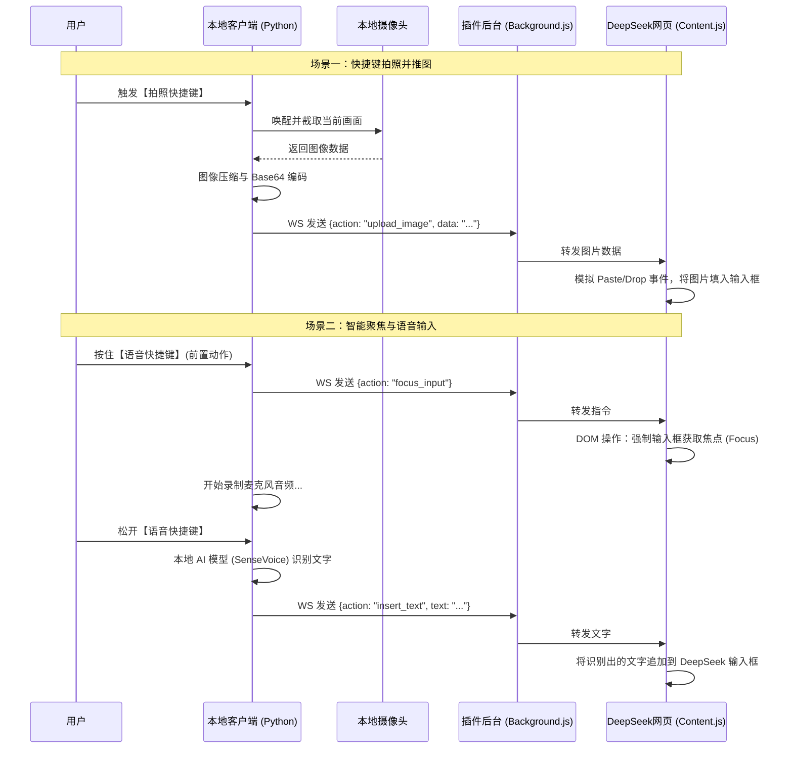

# ChromeChain 技术架构与实现方案

## 1. 系统概述
本方案旨在构建一个名为 **ChromeChain** 的本地与浏览器联动系统。该系统通过监听本地全局快捷键，调度本地硬件（摄像头、麦克风），并通过 WebSocket 长连接将获取的图像和语音识别结果，精准无缝地注入到 **DeepSeek 网页版** 的输入框中，实现极速的多模态交互。

## 2. 系统整体架构

整个系统分为两个核心子系统：**本地守护客户端 (Python)** 和 **浏览器注入插件 (Chrome Extension)**。



## 3. 核心模块设计

### 3.1 本地客户端 (Python 端)
负责硬件调度与重度计算任务。
*   **全局热键监听模块**：基于 `keyboard` 模块，监听独立的两组快捷键（如 `F5` 拍照，按住 `F4` 语音）。
*   **图像采集模块**：基于 `OpenCV (cv2)`，在监听到快捷键时，瞬间抓取 `VideoCapture(0)` 的一帧，转换为 JPEG 格式并进行 Base64 编码。
*   **语音 AI 引擎模块**：集成现有的 `FunASR` 极速识别引擎，处理按下按键期间的音频流。
*   **WebSocket Server 模块**：基于 `websockets` 或 `FastAPI`，在本地监听特定端口（如 `ws://127.0.0.1:8765`），等待浏览器插件主动连接。

### 3.2 浏览器插件端 (Chrome Extension - Manifest V3)
负责突破浏览器沙盒，将本地数据打通至网页 DOM。
*   **Background (Service Worker)**：启动时即连接本地的 WebSocket 端口，保持长连接。当收到 Python 发来的指令时，通过 `chrome.tabs.sendMessage` 将指令派发给当前处于激活状态的 DeepSeek 网页。
*   **Content Script (网页注入脚本)**：直接运行在 DeepSeek 网页上下文中。
    *   **方法定位**：通过 CSS 选择器（如 `textarea` 或特定 ID）精准找到 DeepSeek 的输入框。
    *   **焦点控制**：收到 `focus_input` 指令时，执行 `element.focus()`。
    *   **图像注入黑科技**：由于前端安全限制，不能直接修改 input type=file 的值。技术方案是将收到的 Base64 转为 `File` 对象，然后构建一个伪造的 `ClipboardEvent` (粘贴事件) 或 `DragEvent` (拖拽事件)，派发给 DeepSeek 的输入框，触发网页自带的图片上传逻辑。

## 4. WebSocket 通信协议定义 (JSON)

双方通信采用轻量级的 JSON 格式：

**1. 图片上传指令**
```json
{
  "action": "upload_image",
  "data": "data:image/jpeg;base64,/9j/4AAQSkZJRgABAQEAAAAAA..." 
}
```

**2. 输入框聚焦指令**
```json
{
  "action": "focus_input"
}
```

**3. 文本输入指令** (替代模拟键盘，更加稳定)
```json
{
  "action": "insert_text",
  "text": "这是刚才识别出来的语音内容"
}
```

## 5. 关键技术难点与解决方案

- **难点一：如何把图片塞进 DeepSeek 的输入框？**
  现代网页的输入框通常是被 React/Vue 接管的，直接修改 DOM 的 value 往往无效。
  **解决方案**：在 Content Script 中，把 Base64 转换为 Blob 数据，然后构建一个原生的 `Paste` 事件派发给输入框元素。这样 DeepSeek 网页的底层逻辑会以为是你用鼠标右键“粘贴”了一张图片，从而自动触发它的上传接口。

- **难点二：语音输入时的光标丢失问题**
  如果在说话期间，用户不小心点到了网页的其他地方，键盘模拟输出的文字就会丢失。
  **解决方案**：摒弃之前使用 `keyboard.write()` 模拟物理键盘的做法。既然我们已经有了 WebSocket 连接，当语音识别完成后，Python 直接把文本发给浏览器插件，由插件通过 JavaScript 直接将文字写入 DeepSeek 的输入框。这实现了绝对的稳定性。

- **难点三：多标签页并行时的精准投递问题**
  如果用户同时打开了多个 DeepSeek 网页，并在不同标签页之间随意切换，如何保证数据（图片和文字）只发送到当前正在看的那个标签页，而不导致多个页面同时输入？
  **解决方案**：**“总线路由”架构**。由插件后台 (Background) 负责维持与 Python 的唯一 WebSocket 长连接。当后台收到数据时，动态调用 `chrome.tabs.query({ active: true, currentWindow: true })` API，查明浏览器当前正处于激活状态 (active) 的标签页，并将数据专属投递给该标签页的注入代码。这不仅做到了 100% 精准的“无缝切换”，还免去了 Python 端管理并发连接的负担。

## 6. 桌面客户端 GUI 界面演进计划 (AURA 风格)

为了摆脱控制台的束缚，提供更极客、更现代的用户体验，本地 Python 客户端将升级为基于 **PyQt6** 的无边框悬浮窗应用。

### 6.1 设计目标解析
1. **暗黑模式与极简排版**：深灰色背景，高对比度的亮色文字和发光效果。
2. **动态音频可视化**：中间设计发光音频波形图（双色相交曲线），支持动态反馈。
3. **底部导航栏**：悬浮式的底部控制条（麦克风、历史、设置功能入口）。
4. **无边框悬浮窗**：去除 Windows 默认标题栏，实现可随意拖动、带圆角的现代化窗口。

### 6.2 GUI 文件结构模块化设计
所有的 UI 相关代码将严格收敛至独立的 `GUI` 文件夹内，实现界面与底层 AI 逻辑的深度解耦：

```text
ChromeChain/
└── GUI/
    ├── main_window.py          # 主窗口容器（负责无边框控制、拖拽逻辑）
    ├── style.qss               # 全局样式表（控制霓虹发光、颜色、圆角）
    ├── widgets/
    │   ├── top_bar.py          # 顶部标题栏（AURA Logo、头像）
    │   ├── audio_wave.py       # 核心波形区（绘制动态双色贝塞尔曲线）
    │   └── bottom_nav.py       # 底部导航条（控制图标）
    └── assets/                 # 存放 UI 图标 (icons) 和图片资源
```

### 6.3 UI 架构与线程隔离
*   **渲染技术**：使用 `Qt.WindowType.FramelessWindowHint` 与 `Qt.Attribute.WA_TranslucentBackground` 实现透明与无边框效果。波形图利用 `QPainter` 与 `QGraphicsDropShadowEffect` 渲染发光特效。
*   **线程隔离安全**：界面运行在 MainThread 主线程，而底层硬件调用（OpenCV 拍照）、WebSocket 通信和 FunASR 语音识别必须全部放入独立的 `QThread`（工作子线程）中。
*   **事件驱动**：底层的各种状态（如“正在识别中”、“连接断开”等）统一通过 PyQt 的**信号与槽机制 (pyqtSignal)** 异步推送到主界面进行渲染，确保极致流畅的交互体验。
