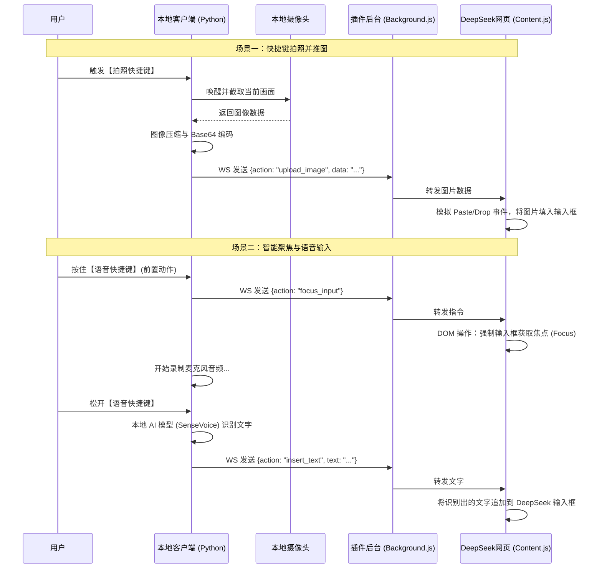

# ChromeChain 技术架构与实现方案

## 1. 系统概述
本方案旨在构建一个名为 **ChromeChain** 的本地与浏览器联动系统。该系统通过监听本地全局快捷键，调度本地硬件（摄像头、麦克风），并通过 WebSocket 长连接将获取的图像和语音识别结果，精准无缝地注入到 **DeepSeek 网页版** 的输入框中，实现极速的多模态交互。

## 2. 系统整体架构

整个系统分为两个核心子系统：**本地守护客户端 (Python)** 和 **浏览器注入插件 (Chrome Extension)**。



## 3. 核心模块设计

### 3.1 本地客户端 (Python 端)
负责硬件调度与重度计算任务。
*   **全局热键监听模块**：基于 `keyboard` 模块，监听独立的两组快捷键（如 `F5` 拍照，按住 `F4` 语音）。
*   **图像采集模块**：基于 `OpenCV (cv2)`，在监听到快捷键时，瞬间抓取 `VideoCapture(0)` 的一帧，转换为 JPEG 格式并进行 Base64 编码。
*   **语音 AI 引擎模块**：集成现有的 `FunASR` 极速识别引擎，处理按下按键期间的音频流。
*   **WebSocket Server 模块**：基于 `websockets` 或 `FastAPI`，在本地监听特定端口（如 `ws://127.0.0.1:8765`），等待浏览器插件主动连接。

### 3.2 浏览器插件端 (Chrome Extension - Manifest V3)
负责突破浏览器沙盒，将本地数据打通至网页 DOM。
*   **Background (Service Worker)**：启动时即连接本地的 WebSocket 端口，保持长连接。当收到 Python 发来的指令时，通过 `chrome.tabs.sendMessage` 将指令派发给当前处于激活状态的 DeepSeek 网页。
*   **Content Script (网页注入脚本)**：直接运行在 DeepSeek 网页上下文中。
    *   **方法定位**：通过 CSS 选择器（如 `textarea` 或特定 ID）精准找到 DeepSeek 的输入框。
    *   **焦点控制**：收到 `focus_input` 指令时，执行 `element.focus()`。
    *   **图像注入黑科技**：由于前端安全限制，不能直接修改 input type=file 的值。技术方案是将收到的 Base64 转为 `File` 对象，然后构建一个伪造的 `ClipboardEvent` (粘贴事件) 或 `DragEvent` (拖拽事件)，派发给 DeepSeek 的输入框，触发网页自带的图片上传逻辑。

## 4. WebSocket 通信协议定义 (JSON)

双方通信采用轻量级的 JSON 格式：

**1. 图片上传指令**
```json
{
  "action": "upload_image",
  "data": "data:image/jpeg;base64,/9j/4AAQSkZJRgABAQEAAAAAA..." 
}
```

**2. 输入框聚焦指令**
```json
{
  "action": "focus_input"
}
```

**3. 文本输入指令** (替代模拟键盘，更加稳定)
```json
{
  "action": "insert_text",
  "text": "这是刚才识别出来的语音内容"
}
```

## 5. 关键技术难点与解决方案

- **难点一：如何把图片塞进 DeepSeek 的输入框？**
  现代网页的输入框通常是被 React/Vue 接管的，直接修改 DOM 的 value 往往无效。
  **解决方案**：在 Content Script 中，把 Base64 转换为 Blob 数据，然后构建一个原生的 `Paste` 事件派发给输入框元素。这样 DeepSeek 网页的底层逻辑会以为是你用鼠标右键“粘贴”了一张图片，从而自动触发它的上传接口。

- **难点二：语音输入时的光标丢失问题**
  如果在说话期间，用户不小心点到了网页的其他地方，键盘模拟输出的文字就会丢失。
  **解决方案**：摒弃之前使用 `keyboard.write()` 模拟物理键盘的做法。既然我们已经有了 WebSocket 连接，当语音识别完成后，Python 直接把文本发给浏览器插件，由插件通过 JavaScript 直接将文字写入 DeepSeek 的输入框。这实现了绝对的稳定性。

- **难点三：多标签页并行时的精准投递问题**
  如果用户同时打开了多个 DeepSeek 网页，并在不同标签页之间随意切换，如何保证数据（图片和文字）只发送到当前正在看的那个标签页，而不导致多个页面同时输入？
  **解决方案**：**“总线路由”架构**。由插件后台 (Background) 负责维持与 Python 的唯一 WebSocket 长连接。当后台收到数据时，动态调用 `chrome.tabs.query({ active: true, currentWindow: true })` API，查明浏览器当前正处于激活状态 (active) 的标签页，并将数据专属投递给该标签页的注入代码。这不仅做到了 100% 精准的“无缝切换”，还免去了 Python 端管理并发连接的负担。

## 6. 桌面客户端 GUI 界面演进计划 (AURA 风格)

为了摆脱控制台的束缚，提供更极客、更现代的用户体验，本地 Python 客户端将升级为基于 **PyQt6** 的无边框悬浮窗应用。

### 6.1 设计目标解析
1. **暗黑模式与极简排版**：深灰色背景，高对比度的亮色文字和发光效果。
2. **动态音频可视化**：中间设计发光音频波形图（双色相交曲线），支持动态反馈。
3. **底部导航栏**：悬浮式的底部控制条（麦克风、历史、设置功能入口）。
4. **无边框悬浮窗**：去除 Windows 默认标题栏，实现可随意拖动、带圆角的现代化窗口。

### 6.2 GUI 文件结构模块化设计
所有的 UI 相关代码将严格收敛至独立的 `GUI` 文件夹内，实现界面与底层 AI 逻辑的深度解耦：

```text
ChromeChain/
└── GUI/
    ├── main_window.py          # 主窗口容器（负责无边框控制、拖拽逻辑）
    ├── style.qss               # 全局样式表（控制霓虹发光、颜色、圆角）
    ├── widgets/
    │   ├── top_bar.py          # 顶部标题栏（AURA Logo、头像）
    │   ├── audio_wave.py       # 核心波形区（绘制动态双色贝塞尔曲线）
    │   └── bottom_nav.py       # 底部导航条（控制图标）
    └── assets/                 # 存放 UI 图标 (icons) 和图片资源
```

### 6.3 UI 架构与线程隔离
*   **渲染技术**：使用 `Qt.WindowType.FramelessWindowHint` 与 `Qt.Attribute.WA_TranslucentBackground` 实现透明与无边框效果。波形图利用 `QPainter` 与 `QGraphicsDropShadowEffect` 渲染发光特效。
*   **线程隔离安全**：界面运行在 MainThread 主线程，而底层硬件调用（OpenCV 拍照）、WebSocket 通信和 FunASR 语音识别必须全部放入独立的 `QThread`（工作子线程）中。
*   **事件驱动**：底层的各种状态（如”正在识别中”、”连接断开”等）统一通过 PyQt 的**信号与槽机制 (pyqtSignal)** 异步推送到主界面进行渲染，确保极致流畅的交互体验。

---

## 7. 待处理问题 (Known Issues)

### 7.1 🔴 双路注入导致重复文字

语音识别结果会被同时以两条路径注入 DeepSeek：

- `voice_engine.py:147` → `keyboard.send('ctrl+v')` 模拟物理粘贴
- `main_window.py:173` → `ws_manager.broadcast_text(text)` 通过 WebSocket 推送

当 Chrome 扩展已连接时，输入框会收到**两份相同的文字**。

**修复方向**：删除 `ctrl+v` 剪贴板链路，统一走 WebSocket 注入。

---

### 7.2 🔴 剪贴板踩踏

`voice_engine.py:142-152` 的剪贴板模拟粘贴逻辑：

```python
original = pyperclip.paste()   # 备份用户剪贴板
pyperclip.copy(text)            # 覆盖为识别结果
keyboard.send('ctrl+v')         # 模拟粘贴
time.sleep(0.05)
pyperclip.copy(original)        # 尝试恢复，但不保证成功
```

0.05 秒延迟完全不够保证 Windows 粘贴操作完成。用户剪贴板内容随时可能丢失，属于**对用户数据的直接损害**。修复 7.1 的同时此问题自然消除。

---

### 7.3 🟡 摄像头链路未接线

相关代码均已写完但未集成：

| 模块 | 位置 | 状态 |
|------|------|------|
| `CameraEngine.capture_frame_base64()` | `core/camera_engine.py` | 无任何地方 import 或调用 |
| `HOTKEY_CAMERA = “alt+2”` | `core/config.py:21` | 快捷键已定义，无人监听 |
| `ws_manager.broadcast_image()` | `server/ws_server.py:71` | 接口就绪，无调用方 |
| `injectImage()` | `extension/content.js:73` | 前端注入逻辑已实现 |
| 拍照快捷键监听 | `core/voice_engine.py` | 缺少对 `alt+2` 的热键注册 |

**修复方向**：在 `VoiceEngine` 中增加对 `alt+2` 热键的监听，触发 `CameraEngine` 拍照 → `ws_manager.broadcast_image()` 推送 → Chrome 扩展注入图片。

---

### 7.4 🟡 底部导航按钮无点击事件

`gui/widgets/bottom_nav.py` 中的三个按钮均未绑定事件处理：

- `btn_mic` — 麦克风按钮，虽有 `micButton` 样式但点击无响应
- `btn_history` — 历史记录按钮，无任何业务逻辑
- `btn_settings` — 设置按钮，无任何业务逻辑

**修复方向**：在 `MainWindow._build_ui` 中连接按钮的 `clicked` 信号到对应槽函数。

---

### 7.5 🟡 顶栏菜单和头像按钮无响应

`gui/widgets/top_bar.py:14-28` 中的 `menu_btn` 和 `avatar` 按钮纯装饰，未绑定任何功能。

---

### 7.6 🟡 WebSocket 服务缺少优雅关闭

`server/ws_server.py:44` 用 `await asyncio.Future()` 永久挂起事件循环。关闭窗口时守护线程随进程死亡，无 `stop()` 方法，无法：

- 通知已连接的客户端断开
- 清理 asyncio 任务
- 释放端口资源

**修复方向**：添加 `stop()` 方法，使用 `asyncio.Event` 替代 `Future()`，`closeEvent` 中调用 `ws_manager.stop()`。

---

### 7.7 🟡 `CameraEngine` 无回调机制

相比 `VoiceEngine` 设计了完整的 `on_xxx` 回调体系，`CameraEngine` 没有任何状态通知机制，外部调用者无法获知拍照成功/失败/异常。

**修复方向**：参考 `VoiceEngine` 的回调模式，增加 `on_capture_success` / `on_capture_error` 回调。

---

### 7.8 🟡 `CameraEngine` 懒初始化无锁保护

```python
def capture_frame_base64(self):
    if self.cap is None:                    # 非原子判断
        self.cap = cv2.VideoCapture(...)     # 可能被多个线程重复执行
```

若在多线程环境下调用，存在竞态条件。

**修复方向**：加 `threading.Lock` 或将初始化移到 `__init__`。

---

### 7.9 🟢 缺少日志体系

全项目使用 `print()` 输出，约 9 处 `print` 散布于 `ws_server.py` 和 `content.js`。无时间戳、无级别、无写入文件能力，调试和维护不便。

**修复方向**：引入 Python `logging` 模块，按模块配置 logger，输出到控制台 + 文件。

---

### 7.10 🟢 扩展硬编码：仅支持 DeepSeek

`extension/manifest.json` 和 `extension/content.js` 中硬编码了 `chat.deepseek.com`。切换到其他 AI 网站（Kimi、豆包、ChatGPT 等）则完全不工作。

**修复方向**：支持多站点配置，提取站点适配层，在 `manifest.json` 中增加其他域名匹配。

---

### 7.11 🟢 内容脚本选择器硬编码

`extension/content.js:32` 中：

```javascript
return document.querySelector('#chat-input') ||
       document.querySelector('textarea, [contenteditable=”true”]');
```

`#chat-input` 是 DeepSeek 当前版本的 ID，DeepSeek 改版即失效。

**修复方向**：维护可配置的选择器优先级列表，或支持多候选选择器自动探测。

---

### 7.12 🟢 模型下载无进度反馈

`VoiceEngine.init_model()` 首次运行会下载约 500MB 模型文件，但无任何进度回调。用户只能看到 “LOADING...” 干等数分钟。

**修复方向**：利用 `funasr.AutoModel` 的下载钩子或自行在下载阶段提供进度通知。

---

### 7.13 🟢 零测试覆盖

项目无任何测试文件。核心模块 `VoiceEngine`、`WebSocketServer`、`signal_bridge` 均无单测。

**修复方向**：为为核心模块添加 pytest 用例，优先覆盖 `VoiceEngine` 的音频处理和识别流程。

---

### 7.14 🟢 `requirements.txt` 版本约束过于宽松

`funasr`、`keyboard`、`pyperclip` 等依赖未锁定版本，未来上游发布不兼容更新可能导致项目无法运行。

**修复方向**：运行 `pip freeze` 锁定当前可工作的版本号。

---

### 7.15 🟢 窗口固定大小

`gui/main_window.py:23` 使用 `setFixedSize(400, 720)`，在小屏幕（1366×768 及以下）可能显示不全。

**修复方向**：改为 `setMinimumSize()` 或支持窗口缩放。

---

### 7.16 🟢 `content.js` MIME 解析无空值保护

```javascript
const mime = parts[0].match(/:(.*?);/)[1];  // 格式不对则抛异常
```

base64 数据若不符合标准 Data URI 格式，直接抛出 TypeError 中断 `injectImage`。

**修复方向**：加 try-catch 或空值检查。

---

### 问题优先级速查

| 优先级 | 编号 | 问题 | 状态 |
|--------|------|------|------|
| 🔴 高 | 7.1 | 双路注入重复文字 | ✅ 已修复 |
| 🔴 高 | 7.2 | 剪贴板踩踏 | ✅ 已修复 |
| 🟡 中 | 7.3 | 摄像头未接线 | ✅ 已修复 |
| 🟡 中 | 7.4 | 按钮无事件 | ✅ 已修复 |
| 🟡 中 | 7.5 | 顶栏按钮无响应 | ✅ 已修复（菜单已接线，头像保留装饰） |
| 🟡 中 | 7.6 | WS 无优雅关闭 | ✅ 已修复 |
| 🟡 中 | 7.7 | CameraEngine 无回调 | ✅ 已修复（通过 CameraBridge 信号机制） |
| 🟡 中 | 7.8 | CameraEngine 无锁保护 | ✅ 已修复 |
| 🟢 低 | 7.9 | 缺少日志体系 | ✅ 已修复 |
| 🟢 低 | 7.10 | 扩展只支持 DeepSeek | ✅ 已修复（支持 Kimi/豆包/ChatGPT/通义千问等） |
| 🟢 低 | 7.11 | 选择器硬编码 | ✅ 已修复（站点适配器模式） |
| 🟢 低 | 7.12 | 模型下载无进度 | ✅ 已修复（GUI 定时提示 + logging） |
| 🟢 低 | 7.13 | 零测试覆盖 | ✅ 已修复（15 个 pytest 用例） |
| 🟢 低 | 7.14 | 依赖未锁定版本 | ✅ 已修复 |
| 🟢 低 | 7.15 | 窗口固定大小 | ✅ 已修复 |
| 🟢 低 | 7.16 | MIME 解析无保护 | ✅ 已修复 |
